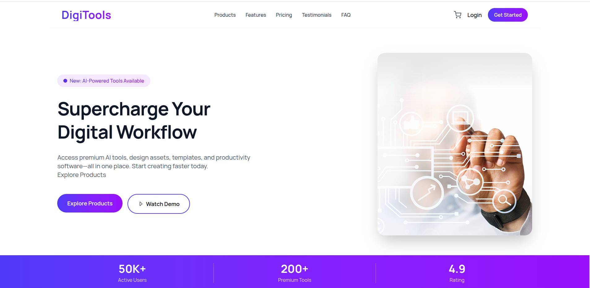
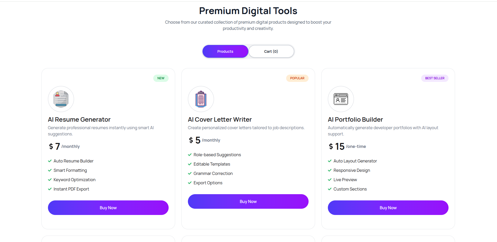
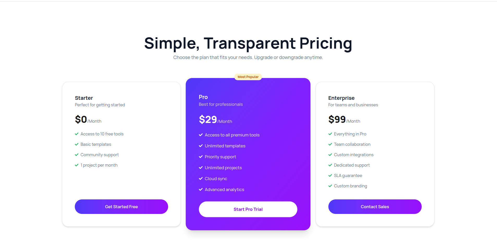

# DigiTools – Premium Digital Tools Platform

  
  
  

**Live Demo:** [https://digitools-platform-kouser.netlify.app/](https://digitools-platform-kouser.netlify.app/)

---

## Project Overview

DigiTools is a modern, responsive web application that showcases and sells premium digital tools and services on a single platform.  
It provides users with a smooth browsing experience, an interactive cart system, and a clean, professional UI suitable for SaaS or digital product marketplaces.  
This project demonstrates real-world frontend practices using React and Tailwind CSS.

---

## Technologies Used

- React.js  
- JavaScript (ES6+)  
- Tailwind CSS  
- React Hooks (useState, useEffect)  
- React Icons  
- React Toastify  
- Vite  
- JSON Data Fetching

---

## Core Features

1. Dynamic Product Listing  
   - Load products from a JSON file asynchronously.  
   - Each card displays name, description, price, features, and tags (new, popular, best seller).  
   - Reusable Card component architecture.

2. Cart Management System  
   - Add/remove products to/from cart.  
   - Prevent duplicate items.  
   - Automatic total price calculation.  
   - Checkout clears cart with success feedback.

3. Modern UI & Responsive Design  
   - Fully responsive for mobile, tablet, and desktop.  
   - Custom navigation with mobile menu support.  
   - Smooth animations and hover effects with Tailwind CSS.  
   - Professional sections: Hero Banner, Pricing, Workflow, Getting Started Steps.

---

## Dependencies

- react  
- react-dom  
- react-icons  
- react-toastify  
- vite  
- tailwindcss  

> All dependencies are listed in package.json and can be installed via npm install.

---

## Project Structure

- Components: Navbar, Footer, Card, Cart, Pricing, Workflow, etc.  
- Pages: Home, Product Listing, Page to Read, etc.  
- Assets: Images, JSON data files.  
- Centralized state managed at the App component level.  
- Clean separation of UI and logic for maintainability.

---

## Local Setup Guide

Navigate to the project folder  
cd digitools  
Install dependencies  
npm install  
Start the development server  
npm run dev  
Open in your browser  
Go to http://localhost:5173 to view the app.

---

## Learning Outcomes

By building DigiTools, you will learn:

Shared state management across components  
Conditional rendering in React  
Designing reusable and maintainable components  
Building real-world UI with Tailwind CSS  
Structuring a complete frontend project ready for extension

---

## Future Improvements

User authentication and login system  
Backend integration for real payments  
Database-driven product management  
Admin dashboard for product control  
Dark mode support

---

## Conclusion

DigiTools is a complete frontend React project demonstrating real-world application design and functionality.  
It is ideal for portfolios, learning advanced React patterns, and extending into a full-stack application.

---

## Links

- Repo Link: [https://github.com/kouser-ahamed/B13-A6-DigiTools-Platform-Kouser](https://github.com/kouser-ahamed/B13-A6-DigiTools-Platform-Kouser)  
- Live Link: [https://digitools-platform-kouser.netlify.app/](https://digitools-platform-kouser.netlify.app/)